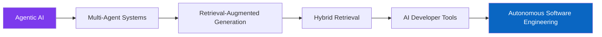

<div align="center">


<a href="https://github.com/Karthik7939">
  
</a>
<a href="https://linkedin.com/in/karthikn-dev">
  
</a>
<a href="https://leetcode.com/u/Karthikk_N/">
  
</a>
<a href="mailto:karthikn4212@gmail.com">
  
</a>

<br/>

<a href="https://github.com/Karthik7939">
  
</a>

</div>

<br/>

## 👨‍💻 About Me

I'm a **CS (Data Science) student** at **New Horizon College of Engineering, Bengaluru**, building AI systems that sit at the intersection of **agentic AI, retrieval-augmented generation, and full-stack engineering**.

```yaml
karthik:
  currently_building: Multi-agent RAG systems for docs and exams
  interested_in: [Agentic AI, RAG pipelines, AI dev tools, Autonomous SWE]
  cgpa: 9.26 / 10
  
```

* 🤖 Agentic AI & Multi-Agent Orchestration
* 🧠 Hybrid Retrieval-Augmented Generation (FAISS + BM25 + RRF)
* 💻 Full-Stack Development (FastAPI · Next.js)
* 📊 Applied Machine Learning
* 🔍 AI-Powered Developer Tools

---

## 🏆 Achievements

<table>
<tr>
<td width="50%">

**🥈 1st Runner-Up**
Capgemini Exceller AgentifAI Buildathon 2026
*(New Horizon — Top 10 finalist overall)*

</td>
<td width="50%">

**🏅 Top 5 Finalist**
Pradyuth Parva 2 — 24hr Hackathon
Sri Sairam College of Engineering

</td>
</tr>
<tr>
<td width="50%">

**💡 Hack.IO**
24hr National-Level Hackathon
KS School of Engineering & Management

</td>
<td width="50%">

**🚀 Astrava**
24hr National-Level Hackathon
Dr. Ambedkar Institute of Technology

</td>
</tr>
</table>

---

## 🚀 Featured Projects

<table width="100%">
<tr>
<td width="100%">


### 🤖&nbsp; Qubit
#### Automated Question Paper Generation using Agentic AI


A multi-agent system that generates syllabus-specific, examination-ready question papers end to end.

| | |
|---|---|
| 🔹 Multi-agent LangGraph pipeline | 🔹 Hybrid retrieval — FAISS + BM25 + RRF |
| 🔹 Google Drive / Classroom ingestion (OAuth) | 🔹 Multi-modal questions — equations, tables, images (LaTeX) |
| 🔹 Handwritten OCR (Surya OCR + VLM fallback) | 🔹 Human-in-the-loop approval workflow |
| 🔹 Bloom's Taxonomy alignment | 🔹 Automatic answer-key generation |

</td>
</tr>
</table>

<br/>

<table width="100%">
<tr>
<td width="100%">


### 📝&nbsp; Automated Code Documentation Updation
#### Agentic AI-Powered Documentation System


Keeps repository documentation continuously synchronized with the codebase as it evolves.

| | |
|---|---|
| 🔹 Bootstrap vs. incremental pipeline split | 🔹 Hybrid retrieval — FAISS + BM25 + dependency graph (tree-sitter) |
| 🔹 LLM abstraction layer (local Ollama ↔ API) | 🔹 AST-diffing & semantic change detection |
| 🔹 Multi-agent generation workflow | 🔹 Auto-generated HTML docs & architecture diagrams |

</td>
</tr>
</table>

<br/>

<table width="100%">
<tr>
<td width="100%">


### 🧠&nbsp; MindStride
#### AI-Powered Student Productivity Platform


Tracks desktop activity and turns it into productivity insight.

| | |
|---|---|
| 🔹 TF-IDF + Logistic Regression classifier | 🔹 Educational vs. entertainment categorization |
| 🔹 Real-time activity logging | 🔹 Productivity aggregation & dashboards |

</td>
</tr>
</table>

<br/>

<table width="100%">
<tr>
<td width="100%">


### 🎯&nbsp; UNIREX
#### Multi-Domain Content Recommendation Engine

A recommendation engine spanning multiple content domains.

</td>
</tr>
</table>

---

## 🛠️ Tech Stack

<div align="center">

**Languages**
<br/>


**Web**
<br/>


**AI / ML**
<br/>
     

**Databases & Tools**
<br/>


</div>

---

## 🧩 LeetCode

Actively practicing **Data Structures & Algorithms** — [**View Profile →**](https://leetcode.com/u/Karthikk_N/)

<div align="center">

</div>

---

## 🎓 Education

| Institution | Program | Duration | Score |
|---|---|---|---|
| New Horizon College of Engineering, Bengaluru | B.E. CSE (Data Science) | 2023 – 2027 | CGPA 9.26 |
| Krupanidhi Residential PU College, Bengaluru | 2nd PUC — PCMC | 2022 – 2023 | 93.8% |
| Bethel Baptist Academy, Bengaluru | X Standard | 2020 – 2021 | 92.48% |

---

## 📜 Certifications

- **Generative AI Landscape** — Infosys Springboard, 2026
- **Artificial Intelligence Fundamentals** — IBM SkillsBuild

---

## 🔭 Currently Exploring

<div align="center">



</div>

Building AI systems that can **reason, retrieve context, use tools, collaborate through agents, and automate complex software engineering workflows.**

---

<div align="center">

### 📫 Let's Connect

[](mailto:karthikn4212@gmail.com)
[](https://linkedin.com/in/karthikn-dev)
[](https://github.com/Karthik7939)
[](https://leetcode.com/u/Karthikk_N/)


**Building intelligent systems, one project at a time.**

</div>
